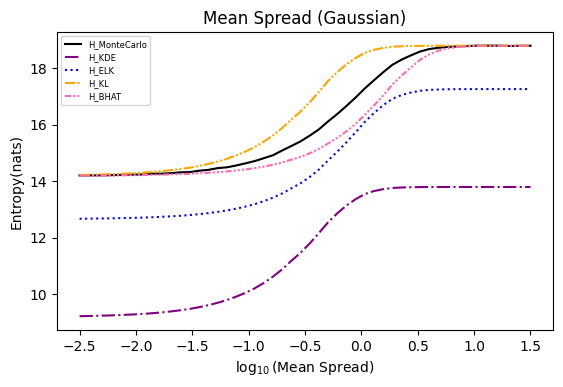
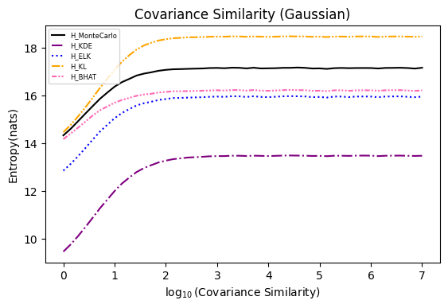
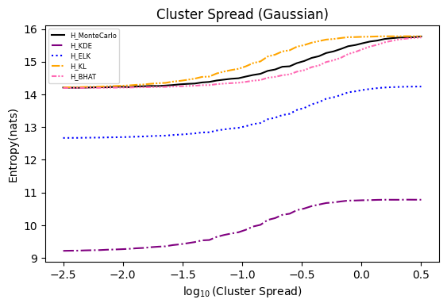
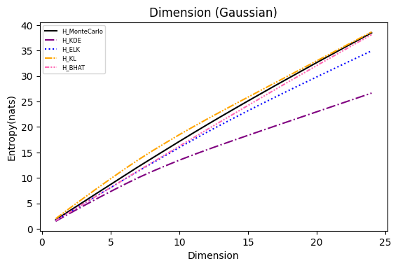
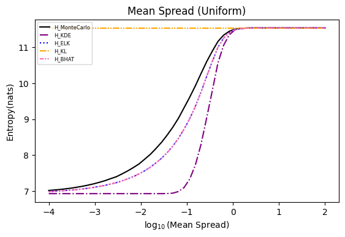
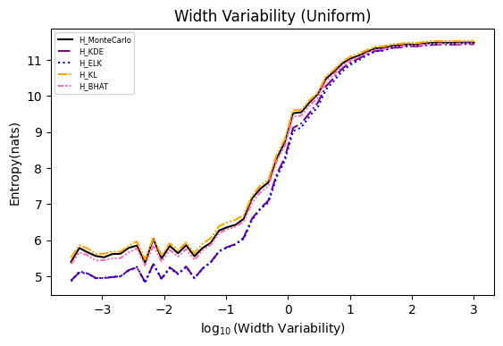
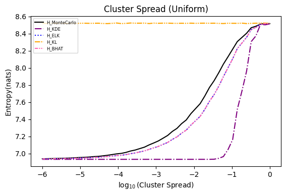
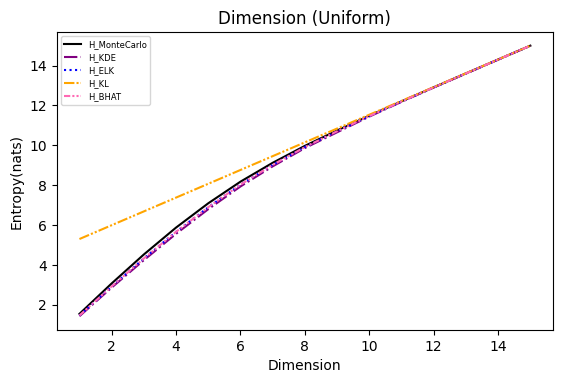

# MixEntroPY

Numpy & PyTorch vectorized implementation of various differential entropy estimators for ML & DL.

## About The Project

Information theory-inspired machine learning methods are gaining increasing interest, with estimation of the entropy as well as mutual information of random variables serving as their cornerstone.

To estimate the Shannon entropy of a _discrete_ random variable, given its probability distribution, one can simply apply the definition of Shannon entropy $H(x)=-\sum_i p(x_i)\log p(x_i)$ to obtain an accurate result.

But when it comes to estimate differential entropy, $h(x)=-\int p(x)\log p(x)dx$, from data points sampled from datasets or models, often there is no prior knowledge about the underlying distribution.

In such cases, we could make an assumption of the unknown distribution and expect the assumed distribution to have a closed-form expression for its entropy calculation, e.g., multivariate Gaussian.

_Kernel Density Estimation(KDE)_ is one of commonly used methods to approximate probability density of a distribution, However, while a single kernel may have a closed-form expression for its entropy, the mixture of these kernels typically does not.

_**This project offers several entropy estimators for these mixture distributions, (mainly focus on mixture of Gaussian and mixture of uniform), implemented with both Numpy and PyTorch.**_

Most of the estimators are **differentiable**, making them suitable for optimization purposes.

## Getting Started

### Installation

Make sure Python >= 3.8 is installed.

`TODO`

## Example Usage

`TODO`

## Brief Introduction of Estimators

|     Estimators      |          Distributions Supported          |              Differentiable              |
| :-----------------: | :---------------------------------------: | :--------------------------------------: |
|     MonteCarlo      | Mixture of Gaussian<br>Mixture of Uniform |                :x:<br>:x:                |
|         KDE         | Mixture of Gaussian<br>Mixture of Uniform |        :white_check_mark:<br>:x:         |
|         ELK         | Mixture of Gaussian<br>Mixture of Uniform | :white_check_mark:<br>:white_check_mark: |
|  PairwiseDist (KL)  | Mixture of Gaussian<br>Mixture of Uniform | :white_check_mark:<br>:white_check_mark: |
| PairwiseDist (Bhat) | Mixture of Gaussian<br>Mixture of Uniform | :white_check_mark:<br>:white_check_mark: |
|       LogDet        |   Multivariate Gaussian<br>or Any other   | :white_check_mark:<br>:white_check_mark: |

---

### Monte Carlo Estimator

Differential entropy is defined[[4]](#4) as:

```math
\large
\begin{align}
h(x) & = -\int_x p(x)\log p(x) dx \\
     & = -\mathbb{E}_x[\log p(x)]
\end{align}
```

Given parameters of the mixture and a bunch of datapoints sampled from that mixture, one can compute the the log probability of each datapoint $x_i$ in the mixture $pdf(x_i)$, and simply estimate entropy by calculate the expectation/average over these log probabilities.

---

### KDE Entropy Estimator

PDF of Kernel Densiti Estimation (KDE)[[5]](#5) is defined as:

```math
\hat{f}(x)=\frac{1}{nh^d}\sum_{j}^{n}K(\frac{x-x_j}{h})
```

where:

- $n$ is the number of elements.
- $h$ is the bandwidth.
- $d$ is number of dimension/variate.
- $K$ is kernel function.

KDE entropy estimator[[1]](#1) using the probabilities of components' mean $\mu_i$:

```math
\begin{align}
\hat{H}_{KDE} & \coloneqq -\frac{1}{n}\sum_{i}^{n}\log{\hat{f}(x_i)} \\
              & = -\frac{1}{n}\sum_{i}^{n}\log{\left[\frac{1}{nh^d}\sum_{j}^{n}K(\frac{x_i-x_j}{h})\right]} \\
              & = -\frac{1}{n}\sum_{i}^{n}\log\left[\sum_{j}^{n}K(\frac{x_i-x_j}{h})\right] + \log{\frac{1}{nh^d}} \\
              & = -\frac{1}{n}\sum_{i}^{n}\log\sum_{j}^{n}K(\frac{x_i-x_j}{h}) + \text{const}
\end{align}
```

For $n$ kernels $K(\cdot)$ weighted by $C\in\mathbb{R}^n$, bandwidth $h=1$:

```math
\begin{align}
\hat{H}_{KDE} & = -\sum_{i}^{n}c_i\log\sum_{j}^{n}c_j K_j(\frac{x_i-x_j}{h}) \\
              & = -\sum_{i}^{n}c_i\log\sum_{j}^{n}c_j p_j(\mu_i)
\end{align}
```

where:

- $p_j(\cdot)$ is the pdf of $j_{th}$ element.
- $\mu_i$ is the mean of $i_{th}$ element.

---

### Expected Likelihood Kernel (ELK) Entropy Estimator

From Jensen's Inequality:

```math
-\large\mathbb{E}_x\left[\log{p(x)}\right] \geq -\log{\mathbb{E}_x\left[(p(x))\right]}
```

we have:

```math
\begin{align}
h(X) & \coloneqq -\int_x\sum_{i}^{n}c_i p_i(x)\log\sum_{j}^{n}c_j p_j(x) dx \\
     & = -\sum_{i}^{n}c_i\int_x p_i(x)log\sum_{j}^{n}c_j p_j(x) dx \\
     & = -\sum_{i}^{n}c_i\mathbb{E}_x\left[\log{\sum_{j}^{n}c_j p_j(x)}\right] \\
     & \geq -\sum_{i}^{n}c_i\log{\left(\mathbb{E}_x\left[\sum_{j}^{n}c_j p_j(x)\right]\right)} \\
     & = -\sum_{i}^{n}c_i\log{\left(\int_x p_i(x)\sum_{j}^{n}c_j p_j(x)\right)} \\
     & = -\sum_{i}^{n}c_i \log{\left(\sum_{j}^{n}c_j\int_xp_i(x)p_j(x)dx\right)}\coloneqq \large\hat{H}_{ELK}(X)
\end{align}
```

where:

```math
\large \int_x p_i(x) p_j(x) dx
```

is a speicial case of **probability product kernel**[[2]](#2) when $\rho=1$, named: **Expected Likelihood Kernel (ELK)**.

Thus we derived this entropy **lower bound** $\hat{H}_{ELK}$

When kernels $p$ are **Gaussian**:

```math
\large\hat{H}_{ELK} = -\sum_{i}^{n}c_i \log{\sum_{j}^{n}c_j q_{j,i}(\mu_i)}
```

where:

```math
\large q_{j,i}(\mu_i)=\mathcal{N}(\mu_j, \Sigma_i + \Sigma_j)
```

When kernels $p$ are **Uniform**:

```math
\large\hat{H}_{ELK} = -\sum_{i}^{n}c_i \log{\sum_{j}^{n}c_j\frac{V_{i\cap j}}{V_i V_j}}
```

where:

- $V_i$ is the volume of the hyper rectangle of $p_i$
- $V_{i\cap j}$ is the volume of overlapping part between $p_i$ and $p_j$

---

### Pairwise Distance Entropy Estimator

Estimate entropy based on **pairwise distance/divergence** between components of the mixture[[3]](#3).

With different distance function $D(\cdot||\cdot)$, lower and upper bounds of the entropy may be drived.

```math
\large\hat{H}_{D}\coloneqq H(X|C)-\sum_{i}^{n}c_i\ln\sum_{j}^{n}c_je^{-D(p_i||p_j)}
```

where:

- $X$ is a $d$ dimensional continuous random variable.
- $C$ is a discrete random variable, each $c_i$ indicates the weight of $i_{th}$ element, thus we have $c_i \geq 0, \sum_{i}^{n}c_i=1$.
- $H(X|C)=\sum_i^n c_iH(p_i)$, that is the weighted average of all components' entropy.
- $D(\cdot || \cdot)$ is the distance function.

When use _Kullback-Leibler (KL) divergence_[[10]](#10) as the distance function, estimation is an _upper_ bound on the entropy.

When use _Bhattacharyya distance_[[9]](#9) as the ditance function, estimation is a _lower_ bound on the entropy.

---

### Logarithm Determinant (LogDet) Entropy Estimator[[6]](#6)

Shannon differential entropy of multivariate Gaussian distribution can be derived as[[7]](#7):

```math
\large
\begin{align}
 h(X) & = \frac{1}{2}\log{\left[(2\pi e)^N\det(\Sigma_X)\right]} \\
            & =\frac{1}{2}\log\det\Sigma_X + \frac{d}{2}(\log2\pi + 1)
\end{align}
```

Since:

```math
\large \det(A)=\prod_{i=1}^{n}\lambda_i=\lambda_1\lambda_2\cdots\lambda_n
```

where $\lambda_0, \lambda_1, \cdots, \lambda_n$ are $n$ eigenvalues of matrix $A$

We have:

```math
\large h(X)=\frac{1}{2}\log{\sum_{i}^{d}\log{\lambda_i}} + \frac{d}{2}(\log2\pi + 1)
```

To estimate mutual information between the input $X$ and the output $Y$ of a deterministic neural network directly is impossible, because $h(f_X(\cdot)|X)=-\infty$ for deterministic $f(\cdot)$, making mutual information:

```math
I(f_X(\cdot);X)=h(f_X(\cdot))-h(f_X(\cdot)|X)=\infty
```

In order to bypass deterministic issue, others purposed to add independent Gaussian noise $\epsilon\sim\mathcal{N}(0, I)$ to the output $Y$ as injection of stocastisity, and mutual information becomes:

```math
I({\hat{f}_X}(\cdot);X)=I(f_X(\cdot)+\epsilon;X)\in(0, \infty)
```

The covariance matrix of random variable $\hat{Y}=f_X(\cdot) + \epsilon$ becomes:

```math
\Sigma_{\hat{Y}} = \Sigma_Y + I
```

To eliminate artificial bias introduced by added noise, the original covariance matrix $\Sigma_Y$ is enlarged by a factor of $\beta$, leading to LogDet estimator:

```math
\large
\begin{align}
\hat{H}_\text{LogDet}(X) & = \frac{1}{2}\log\det\left(I+\beta\Sigma_X\right) \\
                        & = \frac{1}{2}\log\det\left(I+\beta\frac{X^T X}{n}\right)
\end{align}
```

- where $X=[x_1, x_2,\cdots,x_n]$ represents $n$ samples of the random variable to be estimated, each sample $x$ in $X$ have $d$ dimensions, i.e. $X\in\mathbb{R}^{n\times d}$.

To estimate **joint entropy** of $k$ multivariate Gaussian, given sample set $Z=[X_1, X_2, \dots, X_k]$, where each $X$ in $Z$ represents $n$ samples of $d$ dimensions: $X=[x_1, x_2, \dots, x_n], X\in\mathbb{R}^{n\times d}$, the covariance matrix of $Z$ can be represented as:

```math
\large
\Sigma_Z =
\begin{bmatrix}
\Sigma_{1,1} & \Sigma_{1,2} & \cdots & \Sigma_{1,k} \\
\Sigma_{2,1} & \Sigma_{2,2} & \dots & \Sigma_{2,k} \\
\vdots & \vdots & \ddots & \vdots \\
\Sigma_{k,1} & \Sigma_{k,2} & \dots & \Sigma_{k,k}
\end{bmatrix} \in \mathbb{R}^{kd \times kd}
```

where each entry $\Sigma_{i,j}\in\mathbb{R}^{d\times d}$ represents covariance matrix of $X_i$ and $X_j$:

```math
\large
\begin{align}
\Sigma_{i,j} & =
\begin{bmatrix}
\Sigma_i & F \\
F^T & \Sigma_j
\end{bmatrix} =
\begin{bmatrix}
\frac{{X_i}^T X_i}{n} & \frac{{X_i}^T X_j}{n} \\
\frac{{X_j}^T X_i}{n} & \frac{{X_j}^T X_j}{n}
\end{bmatrix} \\
\end{align}
```

It is easy to see that the size of covariance matrix $\Sigma_Z$ grows exponentially by number of random variables $k$ and number of dimensions $d$, but by applying $\log\det$'s commutative property, the equation can be converted into **the sum over each $X$'s pairwise matrix contains inner product between samples**.

```math
\large
\begin{align}
\hat{H}_\text{LogDet}(X_1, X_2, \cdots, X_k) & = \frac{1}{2}\log\det\left(I + \beta\Sigma_Z\right) \\
                                             & = \frac{1}{2}\log\det\left(I + \frac{\beta}{n}\sum_{i=1}^{k}X_i X_i^T\right)
\end{align}
```

## Experiments

Numerical experiments are performed as described in [[3]](#3), and following are the results.

> **NOTE**:
>
> It is noted in [[3]](#3) that the x axis of these experiments represents _Natural logarithm_ of the hyperparameter $\ln(\cdot)$, while in the experiments conducted here, the result plot aligns with those presented in the paper using $\log_{10}(\cdot)$.
>
> Also, please refer to [[8]](#8) for the official implementation in Golang.

<p float="left">
    
    
</p>
<p float="left">
    
    
</p>
<p float="left">
    
    
</p>
<p float="left">
    
    
</p>

## References

<a id="1">[1]</a> Joe, H. (1989). Estimation of entropy and other functionals of a multivariate density. Annals of the Institute of Statistical Mathematics, 41, 683-697.

<a id="2">[2]</a> Jebara, T., Kondor, R., & Howard, A. (2004). Probability product kernels. The Journal of Machine Learning Research, 5, 819-844.

<a id="3">[3]</a> Kolchinsky, A., & Tracey, B. D. (2017). Estimating mixture entropy with pairwise distances. Entropy, 19(7), 361.

<a id="4">[4]</a> https://en.wikipedia.org/wiki/Differential_entropy

<a id="5">[5]</a> https://en.wikipedia.org/wiki/Kernel_density_estimation

<a id="6">[6]</a> Zhouyin, Z., & Liu, D. (2021). Understanding neural networks with logarithm determinant entropy estimator. arXiv preprint arXiv:2105.03705.

<a id="7">[7]</a> Cover, T. M. (1999). Elements of information theory. John Wiley & Sons.

<a id="8">[8]</a> https://github.com/btracey/mixent/tree/master

<a id="9">[9]</a> https://en.wikipedia.org/wiki/Bhattacharyya_distance

<a id="10">[10]</a> https://en.wikipedia.org/wiki/Kullback%E2%80%93Leibler_divergence
